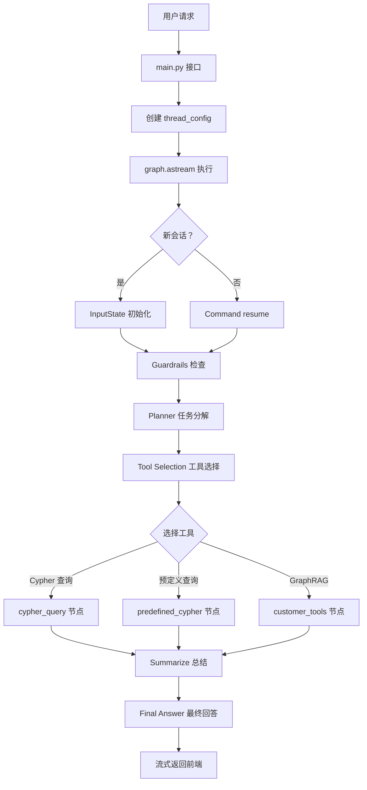

# Agent 开发学习指南

## 📚 基于实战项目的渐进式学习路径

本学习指南基于你已经搭建好的 **电商智能客服 Agent 项目**，带你从入门到精通 Agent 开发。

---

## 🎯 学习目标

- ✅ 理解 Agent 的基本概念和架构
- ✅ 掌握 LangChain 核心组件的使用
- ✅ 掌握 LangGraph 工作流编排
- ✅ 能够独立设计和开发 Agent 应用
- ✅ 具备优化和调试 Agent 系统的能力

---

## 📖 第一阶段：基础认知（1-2 周）

### 1.1 理解 Agent 是什么

#### 🤖 什么是 Agent？

**Agent = LLM + 记忆 + 工具 + 规划**

在你的项目中：
- **LLM**: DeepSeek 或 Ollama 提供的大语言模型
- **记忆**: 会话历史、用户信息、GraphRAG 知识库
- **工具**: Cypher 查询、预定义查询、Microsoft GraphRAG
- **规划**: LangGraph 工作流进行任务分解和路由

#### 📋 阅读材料

1. **项目文档**
   - `llm_backend/README.md` - 了解项目整体架构
   - `USER_ID_FIX_EXPLANATION.md` - 理解数据流传递

2. **核心代码**
   ```python
   # llm_backend/main.py - 入口文件
   @app.post("/api/langgraph/query")
   async def langgraph_query(...):
       # 这里是 Agent 的入口
   ```

3. **状态定义**
   ```python
   # llm_backend/app/lg_agent/lg_states.py
   class AgentState(InputState):
       """Agent 的状态定义了所有信息的流动"""
   ```

### 1.2 LangChain 基础

#### 🔧 核心组件

**1. LLM (Language Model)**
```python
# 在你的项目中使用了两种 LLM
from langchain_deepseek import ChatDeepSeek
from langchain_ollama import ChatOllama

# 使用示例
model = ChatDeepSeek(
    api_key=settings.DEEPSEEK_API_KEY,
    model_name=settings.DEEPSEEK_MODEL,
    temperature=0.7
)
```

**2. Prompt Template (提示模板)**
```python
from langchain_core.prompts import ChatPromptTemplate

prompt = ChatPromptTemplate.from_messages([
    ("system", "你是一个电商客服助手"),
    ("human", "{question}")
])
```

**3. Output Parser (输出解析器)**
```python
from langchain_core.output_parsers import StrOutputParser

parser = StrOutputParser()
```

**4. Chain (链)**
```python
# 组合以上三个组件
chain = prompt | model | parser
result = chain.invoke({"question": "用户问题"})
```

#### 📝 练习任务

**任务 1: 创建一个简单的问答链**

创建文件：`learn_langchain/simple_chain.py`
```python
from langchain_deepseek import ChatDeepSeek
from langchain_core.prompts import ChatPromptTemplate
from langchain_core.output_parsers import StrOutputParser

# 1. 初始化 LLM
llm = ChatDeepSeek(
    api_key="your-api-key",
    model_name="deepseek-chat",
    temperature=0.7
)

# 2. 创建提示模板
prompt = ChatPromptTemplate.from_messages([
    ("system", "你是一个友好的助手"),
    ("human", "{input}")
])

# 3. 创建输出解析器
parser = StrOutputParser()

# 4. 组合成链
chain = prompt | llm | parser

# 5. 执行
result = chain.invoke({"input": "你好，请介绍一下自己"})
print(result)
```

**运行并观察结果**

---

## 📖 第二阶段：LangGraph 入门（2-3 周）

### 2.1 为什么需要 LangGraph？

#### 🤔 问题场景

简单的 Chain 只能线性执行，但实际业务需要：
- ✅ 条件分支（如果 A 则做 X，否则做 Y）
- ✅ 循环迭代（重复直到满足条件）
- ✅ 多 Agent 协作（不同专家处理不同任务）
- ✅ 状态管理（记住之前的执行结果）

#### 💡 LangGraph 解决方案

LangGraph 提供了**状态图（State Graph）**的概念：

```
开始 → 节点 A → 条件判断 → 节点 B 或 节点 C → 结束
              ↑                    ↓
              └────── 循环 ────────┘
```

### 2.2 LangGraph 核心概念

#### 📐 State Graph (状态图)

**在你的项目中的实现：**

```python
# llm_backend/app/lg_agent/lg_builder.py
from langgraph.graph import END, START, StateGraph

# 1. 定义状态
class AgentState(TypedDict):
    messages: list
    router: Router
    steps: list[str]

# 2. 创建图构建器
builder = StateGraph(AgentState, input=InputState)

# 3. 添加节点
builder.add_node("analyze", analyze_and_route_query)
builder.add_node("research", create_research_plan)

# 4. 添加边
builder.add_edge(START, "analyze")
builder.add_conditional_edges(
    "analyze",
    route_by_query_type,  # 条件判断函数
    ["research", "chat"]
)
builder.add_edge("research", END)

# 5. 编译
graph = builder.compile()
```

#### 🔄 Node (节点)

节点是执行具体任务的函数：

```python
async def analyze_and_route_query(
    state: AgentState, 
    *, 
    config: RunnableConfig
) -> dict[str, Router]:
    """分析用户问题并路由到合适的处理节点"""
    
    # 1. 获取用户输入
    last_message = state["messages"][-1].content
    
    # 2. 使用 LLM 分析问题
    model = ChatDeepSeek(...)
    response = await model.with_structured_output(Router).ainvoke(messages)
    
    # 3. 返回路由决策
    return {"router": response}
```

#### 🎛️ Conditional Edge (条件边)

决定下一步去哪个节点：

```python
def route_by_query_type(state: AgentState) -> str:
    """根据问题类型路由"""
    router = state.get("router")
    
    if router.type == "general-query":
        return "general_chat"
    elif router.type == "graphrag-query":
        return "graphrag_search"
    else:
        return "fallback"
```

### 2.3 实战练习

**任务 2: 创建一个简单的多轮对话 Agent**

创建文件：`learn_langgraph/simple_agent.py`
```python
from typing import TypedDict, Annotated
from langgraph.graph import END, START, StateGraph
from langchain_core.messages import BaseMessage, HumanMessage, AIMessage
from langchain_core.runnables import RunnableConfig
from operator import add

# 1. 定义状态
class AgentState(TypedDict):
    messages: Annotated[list[BaseMessage], add]
    step_count: int

# 2. 定义节点
async def chat_node(state: AgentState, config: RunnableConfig):
    """聊天节点"""
    from langchain_deepseek import ChatDeepSeek
    
    model = ChatDeepSeek(api_key="your-key", model_name="deepseek-chat")
    
    # 获取最后一条消息
    last_message = state["messages"][-1]
    
    # 调用 LLM
    response = await model.ainvoke(state["messages"])
    
    return {
        "messages": [AIMessage(content=response.content)],
        "step_count": state["step_count"] + 1
    }

# 3. 定义条件边
def should_continue(state: AgentState) -> str:
    """判断是否继续对话"""
    if state["step_count"] >= 3:  # 最多聊 3 轮
        return "end"
    return "continue"

# 4. 构建图
builder = StateGraph(AgentState)
builder.add_node("chat", chat_node)
builder.add_edge(START, "chat")
builder.add_conditional_edges(
    "chat",
    should_continue,
    {
        "continue": "chat",  # 继续聊天
        "end": END           # 结束
    }
)

# 5. 编译
graph = builder.compile()

# 6. 运行
async def main():
    initial_state = {
        "messages": [HumanMessage(content="你好")],
        "step_count": 0
    }
    
    async for event in graph.astream(initial_state):
        print(event)

import asyncio
asyncio.run(main())
```

**运行并观察多轮对话过程**

---

## 📖 第三阶段：深入理解项目架构（3-4 周）

### 3.1 项目整体架构解析

#### 🏗️ 三层架构

```
┌─────────────────────────────────────────┐
│          API 层 (main.py)               │
│  - HTTP 接口                             │
│  - 参数验证                              │
│  - 线程管理                              │
└─────────────────────────────────────────┘
                ↓
┌─────────────────────────────────────────┐
│      编排层 (lg_builder.py)             │
│  - LangGraph 工作流                      │
│  - 节点协调                              │
│  - 状态管理                              │
└─────────────────────────────────────────┘
                ↓
┌─────────────────────────────────────────┐
│      执行层 (kg_sub_graph/)             │
│  - 具体工具实现                          │
│  - Cypher 生成                           │
│  - GraphRAG 检索                         │
└─────────────────────────────────────────┘
```

### 3.2 核心工作流分析

#### 📊 完整请求处理流程



### 3.3 关键模块详解

#### 🔍 Guardrails (守门员)

**作用**: 判断问题是否在业务范围内

```python
# llm_backend/app/lg_agent/kg_sub_graph/agentic_rag_agents/components/guardrails/node.py
async def guardrails(state, config):
    """判断用户问题是否与电商相关"""
    
    scope_description = """
    个人电商经营范围：智能家居产品
    - 智能照明、智能安防、智能控制等
    不包含：服装、鞋类、食品等
    """
    
    # 使用 LLM 判断
    model = ChatDeepSeek(...)
    prompt = ChatPromptTemplate.from_template("""
    判断以下问题是否与电商相关：{question}
    业务范围：{scope}
    """)
    
    chain = prompt | model
    result = await chain.ainvoke({
        "question": state["question"],
        "scope": scope_description
    })
    
    return {"is_in_scope": "是" in result.content}
```

#### 🎯 Planner (规划师)

**作用**: 将复杂问题分解为多个子任务

```python
# llm_backend/app/lg_agent/kg_sub_graph/planner/planner_node.py
async def create_planner_node(state, config):
    """任务分解"""
    
    prompt = ChatPromptTemplate.from_template("""
    将以下问题分解为多个可执行的子任务：
    
    问题：{question}
    
    每个子任务应该是：
    1. 可以通过一个工具完成
    2. 有明确的输入输出
    """)
    
    model = ChatDeepSeek(...)
    chain = prompt | model.with_structured_output(Plan)
    
    plan = await chain.ainvoke({"question": state["question"]})
    
    return {"tasks": plan.tasks}
```

#### 🛠️ Tool Selection (工具选择器)

**作用**: 为每个子任务选择合适的工具

```python
# llm_backend/app/lg_agent/kg_sub_graph/agentic_rag_agents/components/tool_selection/node.py
async def create_tool_selection_node(state, config):
    """选择工具"""
    
    # 定义可用工具
    tools = [
        cypher_query,      # 动态生成 Cypher
        predefined_cypher, # 预定义查询
        microsoft_graphrag_query  # GraphRAG 检索
    ]
    
    model = ChatDeepSeek(...)
    model_with_tools = model.bind_tools(tools)
    
    # 让 LLM 选择工具
    response = await model_with_tools.ainvoke(messages)
    
    # 返回工具调用信息
    if response.tool_calls:
        return {"tool_call": response.tool_calls[0]}
```

### 3.4 数据流追踪

#### 🔎 user_id 的完整旅程

这是一个很好的学习案例，理解数据如何在系统中流动：

```python
# 1. 前端请求
POST /api/langgraph/query
{
    "query": "我的订单",
    "user_id": 101  # ← 从这里开始
}

# 2. main.py 接收并配置
thread_config = {
    "configurable": {
        "thread_id": "xxx",
        "user_id": 101  # ← 放入 config
    }
}

# 3. LangGraph 执行时传递
async for event in graph.astream(
    input_state,
    config=thread_config  # ← 传入配置
):

# 4. 节点中获取
async def cypher_query(state, config: RunnableConfig):
    user_id = config.get("configurable", {}).get("user_id")  # ← 提取
    
# 5. 用于 Cypher 查询
cypher = f"MATCH (o:Order)<-[:PLACED_BY]-(c:Customer {{UserID: {user_id}}})"
```

**学习建议**: 跟踪一个完整请求，打印每一步的日志，理解数据如何传递和转换。

---

## 📖 第四阶段：动手实践（4-6 周）

### 4.1 模仿现有功能

#### 练习 3: 添加一个新的工具

**目标**: 为 Agent 添加"查询天气"的功能

**步骤 1: 定义工具 Schema**

创建文件：`llm_backend/app/tools/weather_tool.py`
```python
from pydantic import BaseModel, Field

class WeatherQuery(BaseModel):
    """查询天气的工具"""
    city: str = Field(..., description="要查询的城市名称，如'北京'")
    date: str = Field(default="今天", description="日期，默认为'今天'")
```

**步骤 2: 实现工具函数**

```python
import requests

async def query_weather(city: str, date: str = "今天") -> str:
    """实际查询天气的函数"""
    
    # 这里可以调用真实的天气 API
    # 为了演示，我们模拟返回
    return f"{city}{date}的天气：晴，温度 25°C"
```

**步骤 3: 在 Tool Selection 中注册**

修改：`llm_backend/app/lg_agent/lg_builder.py`
```python
# 导入新工具
from app.tools.weather_tool import WeatherQuery

# 添加到工具列表
tool_schemas: List[type[BaseModel]] = [
    cypher_query,
    predefined_cypher,
    microsoft_graphrag_query,
    WeatherQuery  # ← 添加新工具
]
```

**步骤 4: 添加工具执行逻辑**

修改：`llm_backend/app/lg_agent/kg_sub_graph/agentic_rag_agents/components/tool_selection/node.py`
```python
async def execute_tool(tool_call: ToolCall):
    """执行选择的工具"""
    
    if tool_call["name"] == "WeatherQuery":
        args = tool_call["args"]
        result = await query_weather(args["city"], args["date"])
        return {"tool_result": result}
    
    # ... 其他工具的执行逻辑
```

**步骤 5: 测试**

```bash
curl -X POST "http://localhost:8000/api/langgraph/query" \
  -F "query=北京今天天气怎么样" \
  -F "user_id=101"
```

### 4.2 扩展现有能力

#### 练习 4: 优化 User ID 传递

基于你之前的修复，尝试：

**任务**: 将 `user_id` 添加到状态定义中，使其在整个工作流中可用

```python
# llm_backend/app/lg_agent/kg_sub_graph/agentic_rag_agents/components/state.py
class InputState(TypedDict):
    question: str
    data: List[Dict[str, Any]]
    history: Annotated[List[HistoryRecord], update_history]
    user_id: int  # ← 添加这个字段

class OverallState(TypedDict):
    question: str
    tasks: Annotated[List[Task], add]
    # ... 其他字段
    user_id: int  # ← 添加这个字段
```

然后在 `lg_builder.py` 中传递：
```python
input_state = {
    "question": last_message,
    "data": [],
    "history": [],
    "user_id": config.get("configurable", {}).get("user_id", 101)
}
```

这样其他节点就可以直接从 `state` 中获取 `user_id`，而不需要通过 `config`。

### 4.3 调试和优化

#### 🐛 调试技巧

**1. 添加详细日志**

```python
from app.core.logger import get_logger
logger = get_logger(service="my_node")

async def my_node(state, config):
    logger.info(f"进入节点，state: {state}")
    # ... 逻辑
    logger.info(f"离开节点，结果：{result}")
    return result
```

**2. 使用断点调试**

在 VSCode 中配置 `.vscode/launch.json`:
```json
{
    "name": "Python: FastAPI",
    "type": "python",
    "request": "launch",
    "module": "uvicorn",
    "args": [
        "llm_backend.main:app",
        "--reload",
        "--port",
        "8000"
    ],
    "justMyCode": true
}
```

**3. 打印执行轨迹**

```python
# 在节点中添加
print("=" * 50)
print(f"节点名称：my_node")
print(f"输入 state keys: {state.keys()}")
print(f"输出: {result}")
print("=" * 50)
```

#### ⚡ 优化建议

**1. 缓存优化**

```python
from functools import lru_cache

@lru_cache(maxsize=100)
def get_user_info(user_id: int):
    """缓存用户信息查询"""
    # 数据库查询
    return user_data
```

**2. 并发执行**

```python
# 并行执行多个独立任务
import asyncio

results = await asyncio.gather(
    task1(),
    task2(),
    task3()
)
```

**3. 错误处理**

```python
from tenacity import retry, stop_after_attempt, wait_exponential

@retry(
    stop=stop_after_attempt(3),
    wait=wait_exponential(multiplier=1, min=4, max=10)
)
async def call_llm_service(prompt):
    """带重试的 LLM 调用"""
    return await model.ainvoke(prompt)
```

---

## 📖 第五阶段：高级主题（持续学习）

### 5.1 Multi-Agent 系统

#### 👥 多 Agent 协作模式

在你的项目中已经实现了 Multi-Agent 的雏形：

```
┌─────────────────┐
│  Coordinator    │ ← 协调者 Agent
└────────┬────────┘
         │
    ┌────┴────┬──────────┬──────────┐
    │         │          │          │
┌───▼───┐ ┌──▼────┐ ┌──▼────┐ ┌──▼────┐
│研究  │ │Cypher │ │预定义 │ │GraphRAG│
│Agent │ │Agent  │ │Agent  │ │Agent  │
└──────┘ └───────┘ └───────┘ └───────┘
```

**学习资源**:
- LangGraph 官方文档：Multi-Agent Collaboration
- 论文：《ChatDev: Communicative Agents for Software Development》

### 5.2 RAG 优化

#### 📚 GraphRAG vs 传统 RAG

你的项目同时使用了两种 RAG：

**传统 RAG** (文档检索):
```python
# 向量相似度搜索
retriever = vector_store.as_retriever()
docs = retriever.get_relevant_documents(query)
```

**GraphRAG** (知识图谱检索):
```python
# 通过 Cypher 查询结构化知识
cypher = generate_cypher(query)
results = neo4j_graph.query(cypher)
```

**优化方向**:
1. **混合检索**: 结合两者优势
2. **查询重写**: 改进用户问题
3. **结果重排序**: 提高相关性

### 5.3 Agent 评估

#### 📊 如何评估 Agent 的好坏？

**评估指标**:

1. **准确性**: 回答是否正确
2. **响应时间**: 从请求到响应的时间
3. **工具使用效率**: 是否选择了合适的工具
4. **用户满意度**: 主观评价

**自动化测试**:

创建文件：`tests/test_agent.py`
```python
import pytest

@pytest.mark.asyncio
async def test_order_query():
    """测试订单查询功能"""
    
    # 准备测试数据
    test_input = {
        "messages": [HumanMessage(content="我的订单状态")],
        "user_id": 101
    }
    
    # 执行
    result = await graph.ainvoke(test_input)
    
    # 验证
    assert "answer" in result
    assert len(result["steps"]) > 0
    print(f"✓ 测试通过")
```

---

## 🎓 学习资源推荐

### 📚 必读文档

1. **官方文档**
   - [LangChain 文档](https://python.langchain.com/)
   - [LangGraph 文档](https://langchain-ai.github.io/langgraph/)
   - [你的项目 README](llm_backend/README.md)

2. **优质博客**
   - LangChain Blog: https://blog.langchain.dev/
   - Lil'Log (吴恩达): https://lilianweng.github.io/

### 🎥 视频教程

1. **LangChain 官方教程** (B 站)
2. **李宏毅 Agent 课程** (YouTube)

### 💻 实战项目

1. **克隆你的项目**，尝试修改每个模块
2. **从零构建**一个简单的 Agent
3. **参与开源**，为 LangChain 贡献代码

---

## 📅 学习时间表示例

| 阶段 | 时间 | 学习内容 | 产出物 |
|------|------|----------|--------|
| 第一阶段 | 1-2 周 | LangChain 基础 | simple_chain.py |
| 第二阶段 | 2-3 周 | LangGraph 入门 | simple_agent.py |
| 第三阶段 | 3-4 周 | 项目架构分析 | 架构图 + 流程图 |
| 第四阶段 | 4-6 周 | 实战练习 | weather_tool + 优化 |
| 第五阶段 | 持续 | 高级主题 | 个人项目 |

---

## 🎯 检查清单

完成每个阶段后，检查是否能够：

### ✅ 第一阶段
- [ ] 解释什么是 Agent
- [ ] 创建简单的 LangChain Chain
- [ ] 使用不同的 LLM 提供商
- [ ] 编写自定义 Prompt

### ✅ 第二阶段
- [ ] 解释为什么需要 LangGraph
- [ ] 创建 StateGraph
- [ ] 添加节点和边
- [ ] 实现条件路由
- [ ] 处理多轮对话

### ✅ 第三阶段
- [ ] 画出项目的完整架构图
- [ ] 追踪一个请求的完整流程
- [ ] 解释每个节点的作用
- [ ] 理解数据如何在系统中流动

### ✅ 第四阶段
- [ ] 独立添加新工具
- [ ] 优化现有功能
- [ ] 调试复杂问题
- [ ] 提出改进建议

### ✅ 第五阶段
- [ ] 设计 Multi-Agent 系统
- [ ] 优化 RAG 效果
- [ ] 建立评估体系
- [ ] 分享学习经验

---

## 💡 学习建议

### ✅ DO (应该做的)

1. **多动手**: 看懂不如写一遍
2. **记笔记**: 记录关键知识点
3. **提问题**: 遇到问题先思考再提问
4. **做分享**: 教是最好的学
5. **跟源码**: 深入理解底层实现

### ❌ DON'T (不应该做的)

1. **不要死记**: 理解原理比记忆 API 重要
2. **不要急躁**: 循序渐进，每天进步一点
3. **不要孤立**: 加入社区，与他人交流
4. **不要放弃**: 遇到困难很正常，坚持就是胜利

---

## 🆘 常见问题

### Q1: 看不懂复杂的代码怎么办？

**A**: 
1. 从最简单的部分开始
2. 添加注释帮助理解
3. 画图梳理逻辑
4. 分而治之，逐个击破

### Q2: 环境配置总是出错？

**A**:
1. 使用虚拟环境：`python -m venv venv`
2. 严格按照 requirements.txt 安装依赖
3. 检查 Python 版本是否匹配
4. 清理缓存重装：`pip cache purge`

### Q3: Agent 总是返回错误结果？

**A**:
1. 检查 LLM API key 是否正确
2. 查看日志定位错误位置
3. 简化输入测试最小案例
4. 使用调试模式逐步执行

### Q4: 如何保持学习动力？

**A**:
1. 设定小目标，完成后奖励自己
2. 加入学习小组，互相监督
3. 定期回顾已学内容，看到进步
4. 关注最新动态，保持好奇心

---

## 📞 获取帮助

1. **项目 Issues**: 在 GitHub 上提问
2. **技术社区**: Stack Overflow, Reddit r/LangChain
3. ** Discord**: LangChain 官方 Discord
4. **微信**: 搜索"LangChain 中文社区"

---

## 🌟 结语

Agent 开发是一个充满挑战和机遇的领域。通过本指南的系统学习，你将：

- 🎯 掌握 Agent 开发的核心理念
- 🛠️ 熟练使用 LangChain 和 LangGraph
- 💼 具备独立开发 Agent 应用的能力
- 🚀 为未来的职业发展打下坚实基础

**记住**: 最好的学习时间是现在，最好的学习方式是实践。

祝你学习顺利！🎉

---

*最后更新：2026-03-14*  
*基于项目版本：电商智能客服 Agent v1.0*
