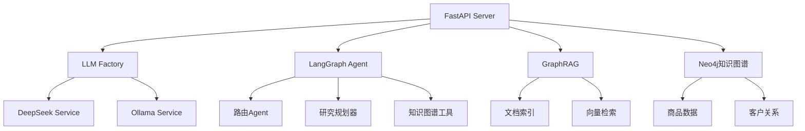

# AssistGen - 智能客服系统

<div align="center">


*基于FastAPI构建的智能客服系统，集成Agent和RAG技术栈*

</div>

## ✨ 特性

- 🤖 **多模型支持**: DeepSeek V3、Qwen2.5、Llama3系列
- 🧠 **智能Agent系统**: 基于LangGraph的多智能体架构  
- 📚 **RAG检索增强**: 微软GraphRAG + 向量数据库
- 🔍 **知识图谱**: Neo4j电商数据模型
- 🚀 **高性能**: FastAPI + Redis缓存
- 🌐 **网络搜索**: SerpAPI集成
- 💬 **会话管理**: 持久化聊天历史
- 🔧 **性能测试**: Ollama基准测试工具

## 🏗️ 系统架构



### 🔧 核心组件

| 组件 | 描述 |
|------|------|
| **FastAPI应用** | 主服务器，提供聊天、推理、文件上传API |
| **LLM工厂** | 支持DeepSeek和Ollama模型的服务工厂 |
| **LangGraph Agent** | 多智能体系统，处理复杂查询路由 |
| **GraphRAG集成** | 微软GraphRAG文档索引和检索 |
| **Neo4j知识图谱** | 电商数据模型，包含商品、订单、客户信息 |

## 🚀 快速开始

### 环境要求

- Python 3.8+
- Neo4j 4.0+
- Redis 6.0+
- MySQL 8.0+

### 安装部署

1. **克隆项目**
```bash
git clone <repository-url>
cd deepseek_agent
```

2. **创建虚拟环境**
```bash
python -m venv .venv
source .venv/bin/activate  # Linux/Mac
# .venv\Scripts\activate   # Windows
```

3. **安装依赖**
```bash
pip install -r requirements.txt
```

4. **配置环境变量**
```bash
# 复制环境配置文件
cp llm_backend/.env.example llm_backend/.env

# 编辑配置文件，填入以下必要信息：
# - DEEPSEEK_API_KEY: DeepSeek API密钥
# - SERPAPI_KEY: 搜索API密钥  
# - 数据库连接信息（MySQL/Neo4j/Redis）
```

5. **初始化数据库**
```bash
cd scripts
python init_db.py
```

6. **启动服务**
```bash
cd llm_backend
python run.py
```

🎉 服务将在 `http://localhost:8000` 启动

## ⚙️ 配置说明

### 模型配置

在 `llm_backend/.env` 中配置：

```bash
# 服务选择 ("deepseek" 或 "ollama")
CHAT_SERVICE=deepseek
REASON_SERVICE=deepseek  
AGENT_SERVICE=deepseek

# API密钥
DEEPSEEK_API_KEY=your_deepseek_key
SERPAPI_KEY=your_serpapi_key
VISION_API_KEY=your_vision_key
```

### 数据库配置

```bash
# MySQL - 会话存储
MYSQL_HOST=localhost
MYSQL_PORT=3306
MYSQL_USER=root
MYSQL_PASSWORD=password
MYSQL_DATABASE=assistgen

# Neo4j - 知识图谱
NEO4J_URI=bolt://localhost:7687
NEO4J_USER=neo4j
NEO4J_PASSWORD=password

# Redis - 缓存
REDIS_HOST=localhost
REDIS_PORT=6379
```

## 📊 API文档

启动服务后访问：
- Swagger UI: `http://localhost:8000/docs`
- ReDoc: `http://localhost:8000/redoc`

### 主要端点

| 端点 | 方法 | 描述 |
|------|------|------|
| `/chat` | POST | 聊天对话 |
| `/reason` | POST | 推理分析 |
| `/upload` | POST | 文件上传 |
| `/langgraph/query` | POST | Agent查询 |
| `/conversation/{id}` | GET | 获取对话历史 |

## 🧪 测试

### 性能测试
```bash
# Ollama模型基准测试
cd llm_backend/app/test
python ollama_benchmark.py

# FastAPI接口测试
python test_fastapi.py
```

### 功能测试
```bash
# DeepSeek API测试
python deepseek_sync.py      # 同步调用测试
python deepseek_stream.py    # 流式调用测试

# 运行单元测试（如果存在）
pytest tests/ -v
```

## 📁 项目结构

```
deepseek_agent/
├── 📁 llm_backend/                    # 🔧 后端服务核心
│   ├── 📁 app/                        # 🏗️ 应用核心模块
│   │   ├── 📁 api/                    # 🌐 API路由层
│   │   ├── 📁 core/                   # ⚙️ 核心配置与中间件
│   │   ├── 📁 graphrag/               # 📊 GraphRAG集成
│   │   ├── 📁 lg_agent/               # 🤖 LangGraph智能体
│   │   ├── 📁 models/                 # 🗄️ 数据模型
│   │   ├── 📁 prompts/                # 💬 提示词模板
│   │   ├── 📁 services/               # 🔧 业务服务层
│   │   ├── 📁 test/                   # 🧪 测试文件
│   │   └── 📁 tools/                  # 🛠️ 工具模块
│   ├── 📄 main.py                     # 🚀 FastAPI应用入口
│   ├── 📄 run.py                      # ▶️ 服务启动脚本
│   └── 📄 README.md                   # 📖 后端详细文档
├── 📁 scripts/                        # 📜 工具脚本
│   └── 📄 init_db.py                  # 🗃️ 数据库初始化
├── 📁 uploads/                        # 📤 文件上传存储
├── 📄 requirements.txt                # 📦 Python依赖包
├── 📄 CLAUDE.md                       # 🤖 Claude代码助手配置
├── 📄 CHANGELOG.md                    # 📝 版本变更日志
└── 📄 README.md                       # 📚 项目主文档
```

### 🏗️ 核心模块说明

| 模块路径 | 功能描述 | 主要文件 |
|----------|----------|----------|
| `app/services/` | 业务逻辑服务层 | `llm_factory.py`, `deepseek_service.py`, `ollama_service.py` |
| `app/lg_agent/` | LangGraph智能体系统 | `main.py`, `lg_states.py`, `kg_sub_graph/` |
| `app/graphrag/` | 微软GraphRAG集成 | `graphrag/`, `dev/`, `origin_data/` |
| `app/api/` | RESTful API接口 | `auth.py` (可扩展更多路由) |
| `app/core/` | 核心配置与工具 | `config.py`, `database.py`, `logger.py` |

## 🤝 贡献

1. Fork 项目
2. 创建特性分支 (`git checkout -b feature/AmazingFeature`)
3. 提交更改 (`git commit -m 'Add some AmazingFeature'`)
4. 推送到分支 (`git push origin feature/AmazingFeature`)
5. 打开 Pull Request

## 📄 许可证

本项目基于 MIT 许可证开源 - 查看 [LICENSE](LICENSE) 文件了解详情

## 🙋‍♂️ 支持

如有问题或建议，请：

- 📧 提交 Issue
- 💬 参与 Discussions
- 📚 查看 Wiki 文档

---

<div align="center">

**⭐ 如果此项目对您有帮助，请给我们一个星标！**
</div> 